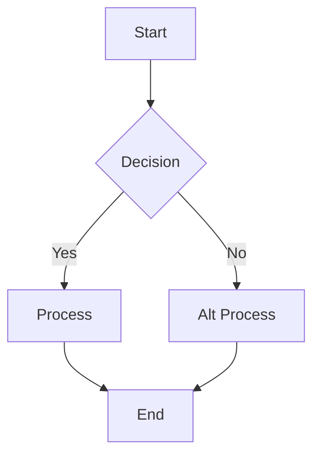
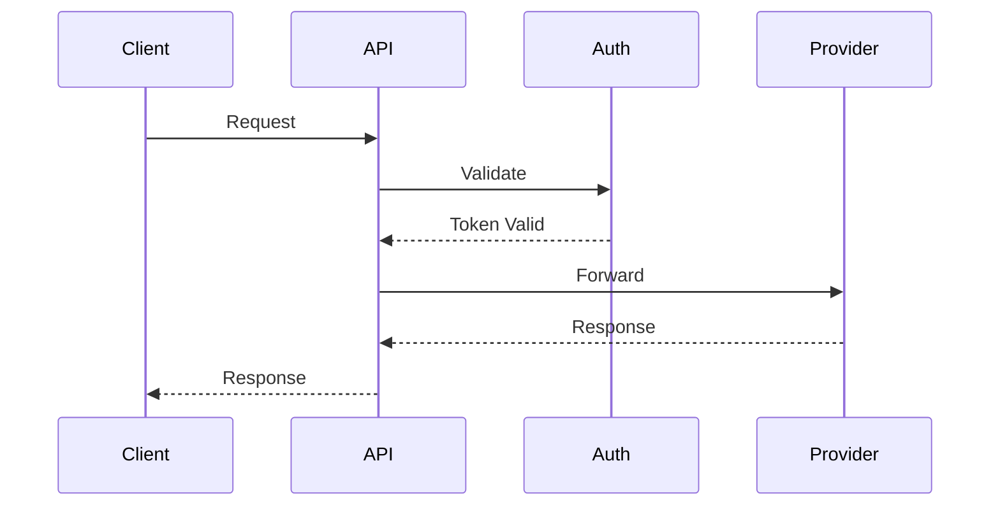
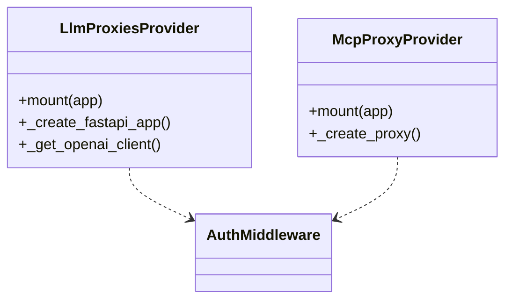
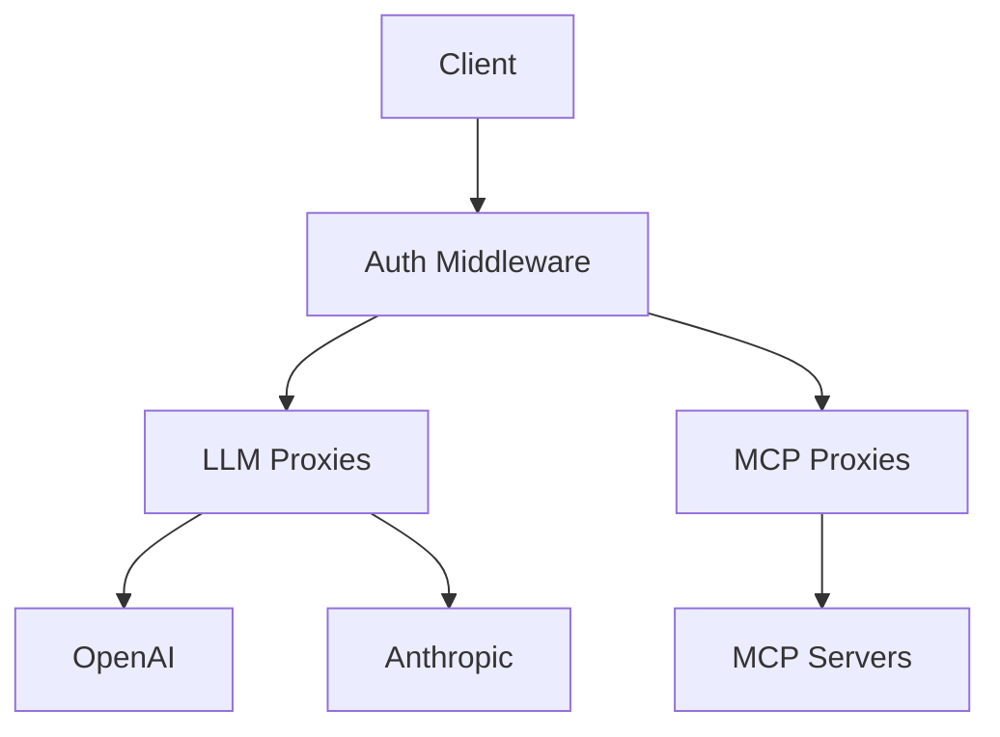
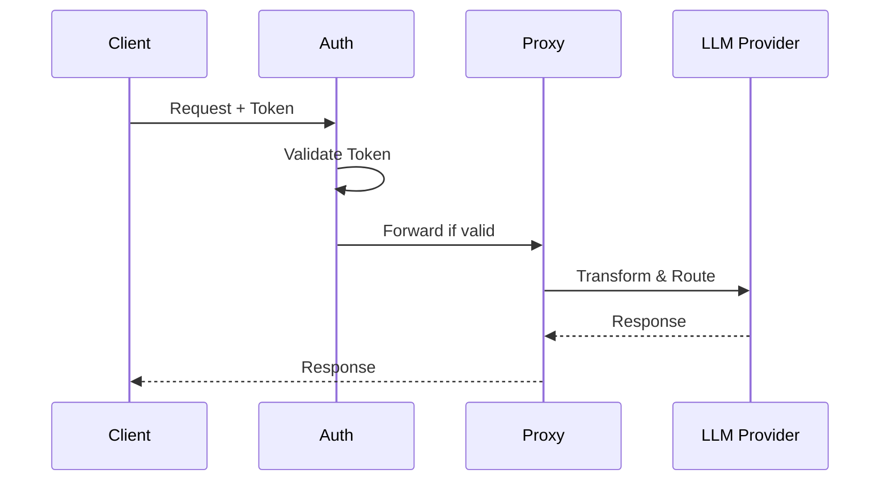

# Draw.io Diagram Skill

Generate professional diagrams using **draw.io MCP server** (opens in browser) or create `.drawio` files with optional PNG/SVG/PDF export for version control.

## Quick Start - Choose Your Workflow

### 🎨 Iterative Edit Workflow (Recommended for Project Diagrams)
**When to use:** Creating/updating project documentation, need to iterate on design
- Generates XML → Saves `.drawio` file to **project root** → Opens in draw.io for editing
- **Persistent file** for ongoing edits and version control
- User can continue editing the same file instead of regenerating
- **Best for:** Architecture diagrams, flowcharts that evolve with the project

### 🚀 MCP Browser Workflow (Quick Preview)
**When to use:** Quick visualization, one-off exploration, prototyping
- Generates diagram → Opens in browser instantly → User saves if needed
- **No files created** unless user explicitly saves from draw.io
- Supports **XML** (full control), **Mermaid** (easy syntax), **CSV** (org charts)
- **Best for:** Exploring ideas, debugging flows, temporary visualizations

### 📸 Export Workflow (Documentation Assets)
**When to use:** Need PNG/SVG/PDF for documentation, presentations, wikis
- Generates XML → Creates `.drawio` file → Exports to format → Opens result
- **Export formats:** PNG, SVG, PDF with embedded XML (editable)
- **Best for:** README images, documentation, presentations

---

## Method 1: Iterative Edit Workflow (Primary for Projects)

**Use when:** User says "create diagram", "update diagram", or mentions project architecture

### Step 1: Determine filename
- Use descriptive name based on diagram type: `architecture.drawio`, `auth-flow.drawio`, `class-diagram.drawio`
- Check if file already exists in project root
- If exists, inform user you're updating the existing file
- If new, use sensible default name

### Step 2: Generate XML content
Create mxGraphModel XML with proper structure and styling

### Step 3: Save to project root
```python
# Save to workspace root
create_file(
    filePath="/Users/steven/_CODE/drunk-mcp-proxy/architecture.drawio",
    content=xml_content
)
```

### Step 4: Open in draw.io
```bash
# macOS
open /Users/steven/_CODE/drunk-mcp-proxy/architecture.drawio

# Linux
xdg-open /path/to/project/diagram.drawio

# Windows
start C:\path\to\project\diagram.drawio
```

### Step 5: Inform user
Tell user:
- ✅ File saved to project root
- 📝 Opened in draw.io for editing
- 💾 Edits auto-save to the file
- 🔄 Run skill again to regenerate if needed

### Benefits:
- **Persistent**: File stays in project, version controlled
- **Iterative**: Open, edit, save, repeat
- **No regeneration**: Manual edits preserved between opens
- **Discoverable**: File visible in project explorer

### Getting Workspace Root:
Always determine the workspace root dynamically - never hardcode paths:
```python
# The workspace root is available from environment/context
# Example: /Users/steven/_CODE/drunk-mcp-proxy
# Save files as: {workspace_root}/{filename}.drawio
```

### File Naming Conventions:
- `architecture.drawio` - Main system architecture
- `{component}-flow.drawio` - Flow diagrams (auth-flow, request-flow)
- `{module}-classes.drawio` - Class diagrams
- Use lowercase with hyphens for multi-word names

---

## Method 2: MCP Browser Workflow (Quick Preview)

### Step 1: Choose format based on diagram type

| Format | Use For | Tool |
|--------|---------|------|
| **XML** | Architecture diagrams, custom shapes, precise control | `mcp_drawio-mcp_open_drawio_xml` |
| **Mermaid** | Flowcharts, sequence diagrams, class diagrams | `mcp_drawio-mcp_open_drawio_mermaid` |
| **CSV** | Org charts, hierarchical data | `mcp_drawio-mcp_open_drawio_csv` |

### Step 2: Generate content and open in browser

**XML Example:**
```python
mcp_drawio-mcp_open_drawio_xml(
    content="<mxGraphModel>...",
    dark="auto",
    lightbox=False
)
```

**Mermaid Example:**
```python
mcp_drawio-mcp_open_drawio_mermaid(
    content="graph TD\n    A[Start] --> B[Process]\n    B --> C[End]",
    dark="auto"
)
```

**CSV Example:**
```python
mcp_drawio-mcp_open_drawio_csv(
    content="# Organization\nCEO,,,Manager,Staff",
    dark="auto"
)
```

### When to use each format:

- **XML**: Complex layouts, custom positioning, specific colors/styles
- **Mermaid**: Quick flowcharts, sequence diagrams, class diagrams - easier syntax
- **CSV**: Organization charts, tree structures from tabular data

---

## Method 3: Export Workflow (Documentation Assets)

Use when user explicitly requests exports (`.png`, `.svg`, `.pdf`) for documentation

### Step 1: Generate XML
Create mxGraphModel XML for the diagram

### Step 2: Write to file
```bash
# Save as architecture.drawio in project root
```

### Step 3: Export using draw.io CLI
```bash
drawio -x -f png -e -b 10 -o architecture.drawio.png architecture.drawio
```

### Step 4: Open exported file
User can view PNG/SVG/PDF and still edit (embedded XML)

---

## Choosing the Workflow

**Decision tree:**

| User Request | Workflow | Action |
|--------------|----------|--------|
| "create architecture diagram" | **Iterative Edit** | Save .drawio to root, open for editing |
| "update the diagram" | **Iterative Edit** | Regenerate XML, overwrite file, open |
| "show me a diagram of..." | MCP Browser | Quick visualization, no file |
| "diagram the flow" | MCP Browser | Preview in browser |
| "save as PNG for README" | Export | Generate, save, export PNG |
| "architecture.drawio.svg" | Export | Generate, save, export SVG |

**Default behavior:**
- If user mentions **"create"** or **"update"** → Use **Iterative Edit Workflow** (save to root)
- If user says **"show"** or **"quick"** → Use **MCP Browser Workflow** (preview only)
- If user specifies **file extension** (.png, .svg, .pdf) → Use **Export Workflow**

**Project root location:**
Get workspace root from environment, save to: `{workspace_root}/{filename}.drawio`

---

## Mermaid Syntax Quick Reference

When using `mcp_drawio-mcp_open_drawio_mermaid`, generate Mermaid.js syntax:

### Flowcharts


### Sequence Diagrams


### Class Diagrams


---

## Project-Specific Patterns (drunk-ai-proxy)

### Standard Filenames for Project Diagrams
Save to workspace root with these conventional names:
- `architecture.drawio` - Overall system architecture
- `auth-flow.drawio` - Authentication and authorization flows
- `request-flow.drawio` - Request handling sequence
- `class-diagram.drawio` - Class relationships and hierarchy
- `deployment.drawio` - Deployment architecture and infrastructure
- `data-flow.drawio` - Data flow and transformations

### Architecture Overview (Use XML with Colors)
Generate XML with component styling:
```xml
<mxGraphModel>
  <root>
    <mxCell id="0"/>
    <mxCell id="1" parent="0"/>
    <!-- Client Layer - Blue -->
    <mxCell id="2" value="Client" style="rounded=1;fillColor=#4A90E2;strokeColor=#2E5C8A;fontColor=#ffffff;" vertex="1" parent="1">
      <mxGeometry x="200" y="50" width="120" height="60" as="geometry"/>
    </mxCell>
    <!-- Auth Layer - Red -->
    <mxCell id="3" value="Auth Middleware" style="rounded=1;fillColor=#E74C3C;strokeColor=#C0392B;fontColor=#ffffff;" vertex="1" parent="1">
      <mxGeometry x="200" y="150" width="120" height="60" as="geometry"/>
    </mxCell>
    <!-- Connection -->
    <mxCell id="4" value="Request" style="edgeStyle=orthogonalEdgeStyle;strokeWidth=2;" edge="1" source="2" target="3" parent="1">
      <mxGeometry relative="1" as="geometry"/>
    </mxCell>
  </root>
</mxGraphModel>
```

### Request Flow (Use Mermaid for Quick Preview)
For quick visualization without saving:


### Request Flow (Use Mermaid Sequence)


### Class Structure (Use XML for precise layout)
Generate detailed XML with specific positioning, colors, and relationships.

---

## File-Based Export Formats

When using file-based workflow:

| Format | Embed XML | Notes |
|--------|-----------|-------|
| `png` | Yes (`-e`) | Viewable everywhere, editable in draw.io |
| `svg` | Yes (`-e`) | Scalable, editable in draw.io |
| `pdf` | Yes (`-e`) | Printable, editable in draw.io |
| `jpg` | No | Lossy, no embedded XML support |

PNG, SVG, and PDF all support `--embed-diagram` — the exported file contains the full diagram XML, so opening it in draw.io recovers the editable diagram.

## draw.io CLI

The draw.io desktop app includes a command-line interface for exporting.

### Locating the CLI

Try `drawio` first (works if on PATH), then fall back to the platform-specific path:

- **macOS**: `/Applications/draw.io.app/Contents/MacOS/draw.io`
- **Linux**: `drawio` (typically on PATH via snap/apt/flatpak)
- **Windows**: `"C:\Program Files\draw.io\draw.io.exe"`

Use `which drawio` (or `where drawio` on Windows) to check if it's on PATH before falling back.

### Export command

```bash
drawio -x -f <format> -e -b 10 -o <output> <input.drawio>
```

Key flags:
- `-x` / `--export`: export mode
- `-f` / `--format`: output format (png, svg, pdf, jpg)
- `-e` / `--embed-diagram`: embed diagram XML in the output (PNG, SVG, PDF only)
- `-o` / `--output`: output file path
- `-b` / `--border`: border width around diagram (default: 0)
- `-t` / `--transparent`: transparent background (PNG only)
- `-s` / `--scale`: scale the diagram size
- `--width` / `--height`: fit into specified dimensions (preserves aspect ratio)
- `-a` / `--all-pages`: export all pages (PDF only)
- `-p` / `--page-index`: select a specific page (1-based)

### Opening the result

- **macOS**: `open <file>`
- **Linux**: `xdg-open <file>`
- **Windows**: `start <file>`

## File naming

- Use a descriptive filename based on the diagram content (e.g., `login-flow`, `database-schema`)
- Use lowercase with hyphens for multi-word names
- For export, use double extensions: `name.drawio.png`, `name.drawio.svg`, `name.drawio.pdf` — this signals the file contains embedded diagram XML
- After a successful export, delete the intermediate `.drawio` file — the exported file contains the full diagram

## XML format

A `.drawio` file is native mxGraphModel XML. Always generate XML directly — Mermaid and CSV formats require server-side conversion and cannot be saved as native files.

### Basic structure

Every diagram must have this structure:

```xml
<mxGraphModel>
  <root>
    <mxCell id="0"/>
    <mxCell id="1" parent="0"/>
    <!-- Diagram cells go here with parent="1" -->
  </root>
</mxGraphModel>
```

- Cell `id="0"` is the root layer
- Cell `id="1"` is the default parent layer
- All diagram elements use `parent="1"` unless using multiple layers

### Common styles

**Rounded rectangle:**
```xml
<mxCell id="2" value="Label" style="rounded=1;whiteSpace=wrap;" vertex="1" parent="1">
  <mxGeometry x="100" y="100" width="120" height="60" as="geometry"/>
</mxCell>
```

**Diamond (decision):**
```xml
<mxCell id="3" value="Condition?" style="rhombus;whiteSpace=wrap;" vertex="1" parent="1">
  <mxGeometry x="100" y="200" width="120" height="80" as="geometry"/>
</mxCell>
```

**Arrow (edge):**
```xml
<mxCell id="4" value="" style="edgeStyle=orthogonalEdgeStyle;" edge="1" source="2" target="3" parent="1">
  <mxGeometry relative="1" as="geometry"/>
</mxCell>
```

**Labeled arrow:**
```xml
<mxCell id="5" value="Yes" style="edgeStyle=orthogonalEdgeStyle;" edge="1" source="3" target="6" parent="1">
  <mxGeometry relative="1" as="geometry"/>
</mxCell>
```

## XML Reference (For File-Based or MCP XML Mode)

### Basic Structure
Every XML diagram must have this structure:
```xml
<mxGraphModel>
  <root>
    <mxCell id="0"/>
    <mxCell id="1" parent="0"/>
    <!-- Diagram cells go here with parent="1" -->
  </root>
</mxGraphModel>
```

### Common Shapes
```xml
<!-- Rounded Rectangle -->
<mxCell id="2" value="Label" style="rounded=1;whiteSpace=wrap;" vertex="1" parent="1">
  <mxGeometry x="100" y="100" width="120" height="60" as="geometry"/>
</mxCell>

<!-- Diamond (Decision) -->
<mxCell id="3" value="Condition?" style="rhombus;whiteSpace=wrap;" vertex="1" parent="1">
  <mxGeometry x="100" y="200" width="120" height="80" as="geometry"/>
</mxCell>

<!-- Arrow with Label -->
<mxCell id="4" value="Yes" style="edgeStyle=orthogonalEdgeStyle;" edge="1" source="2" target="3" parent="1">
  <mxGeometry relative="1" as="geometry"/>
</mxCell>
```

### Useful Style Properties
| Property | Values | Use for |
|----------|--------|---------|
| `rounded=1` | 0 or 1 | Rounded corners |
| `fillColor=#dae8fc` | Hex color | Background color |
| `strokeColor=#6c8ebf` | Hex color | Border color |
| `shape=cylinder3` | shape name | Database cylinders |
| `rhombus` | style keyword | Diamonds |
| `edgeStyle=orthogonalEdgeStyle` | style keyword | Right-angle connectors |
| `dashed=1` | 0 or 1 | Dashed lines |

### CRITICAL: XML Well-Formedness
- **NEVER use double hyphens (`--`) inside XML comments** - illegal per XML spec
- Escape special characters: `&amp;`, `&lt;`, `&gt;`, `&quot;`
- Always use unique `id` values for each `mxCell`

---

## Best Practices

### Format Selection Decision Tree

1. **Creating/updating project diagram?** → Use **Iterative Edit** (save .drawio to root)
2. **Quick visualization or exploration?** → Use MCP Browser (Mermaid for simple, XML for complex)
3. **Need PNG/SVG/PDF for docs?** → Use Export Workflow
4. **Want to iterate on same file?** → Use **Iterative Edit** (opens saved file)
5. **One-time prototype/preview?** → Use MCP Browser (no file created)
6. **Flowchart or sequence diagram?** → Mermaid (easier syntax)
7. **Org chart from data?** → MCP Browser with CSV or XML
8. **Custom colors and precise positioning?** → XML (any workflow supports this)

### Workflow Priority (from most common to least)

1. **Iterative Edit** (50% of use cases)
   - "create architecture diagram"
   - "update the flow diagram"
   - "make a class diagram for the project"
   
2. **MCP Browser Preview** (30% of use cases)
   - "show me the auth flow"
   - "quick diagram of the request handling"
   - "visualize the data flow"
   
3. **Export Workflow** (20% of use cases)
   - "create architecture.png for README"
   - "export diagram as SVG"
   - "generate PDF for presentation"

### Common Workflows

**Creating project documentation (PRIMARY):**
```
User: "create architecture diagram for drunk-ai-proxy"
→ Generate XML with colored components
→ Save to /Users/steven/_CODE/drunk-mcp-proxy/architecture.drawio
→ Open in draw.io desktop app
→ User can edit, save continues to update same file
→ File committed to git for team collaboration
```

**Updating existing diagram:**
```
User: "update the architecture diagram"
→ Generate new XML (or read existing and modify)
→ Overwrite /Users/steven/_CODE/drunk-mcp-proxy/architecture.drawio
→ Open in draw.io to show changes
→ User reviews and makes manual tweaks
```

**Quick exploration (no file):**
```
User: "show me the auth flow"
→ Generate Mermaid sequence diagram
→ Call mcp_drawio-mcp_open_drawio_mermaid
→ Opens in browser, user explores
→ No file created unless user saves manually
```

**Exporting for documentation:**
```
User: "create architecture.drawio.png for the README"
→ Generate XML with precise layout
→ Write architecture.drawio to root
→ Export to PNG with embedded XML: architecture.drawio.png
→ User can add to README, still editable later
```

### Tips
- **Iterative Edit** = Best for project diagrams, saves to root, version controlled
- **MCP Browser** = Fast preview, no files unless you save manually
- **Export Workflow** = For README/docs, creates image files
- **Mermaid** = 10x faster than XML for standard diagrams
- **XML** = Full control for complex layouts with custom colors
- **Always** use descriptive filenames with hyphens: `architecture.drawio`, `auth-flow.drawio`
- **For exports**: Use double extensions (`.drawio.png`) to signal embedded XML
- **File persistence**: Saved .drawio files can be opened, edited, and committed to git
- **Workspace root**: Default save location for easy discovery in project explorer