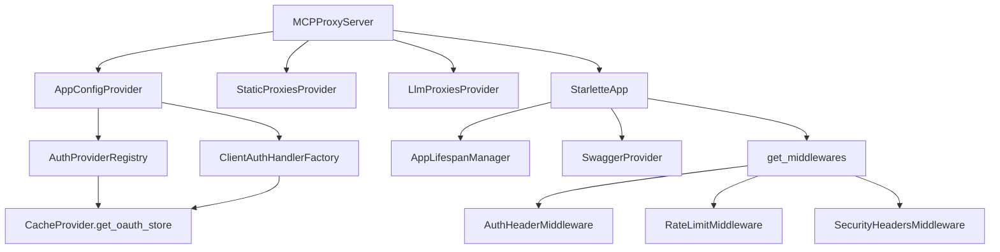

# `app/` Package Diagram

```mermaid
flowchart TD
    A[MCPProxyServer] --> B[AppConfigProvider]
    A --> C[StaticProxiesProvider]
    A --> D[LlmProxiesProvider]
    A --> E[StarletteApp]

    E --> F[AppLifespanManager]
    E --> G[SwaggerProvider]
    E --> H[get_middlewares]

    B --> I[AuthProviderRegistry]
    B --> J[ClientAuthHandlerFactory]

    I --> K[CacheProvider.get_oauth_store]
    J --> K

    H --> L[AuthHeaderMiddleware]
    H --> M[RateLimitMiddleware]
    H --> N[SecurityHeadersMiddleware]
```
