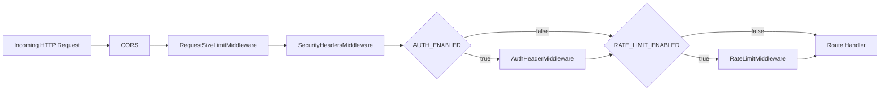

# `middleware/` Package Diagram

```mermaid
flowchart LR
    A[Incoming HTTP Request] --> B[CORS]
    B --> C[RequestSizeLimitMiddleware]
    C --> D[SecurityHeadersMiddleware]
    D --> E{AUTH_ENABLED}
    E -- true --> F[AuthHeaderMiddleware]
    E -- false --> G
    F --> G{RATE_LIMIT_ENABLED}
    G -- true --> H[RateLimitMiddleware]
    G -- false --> I[Route Handler]
    H --> I
```
