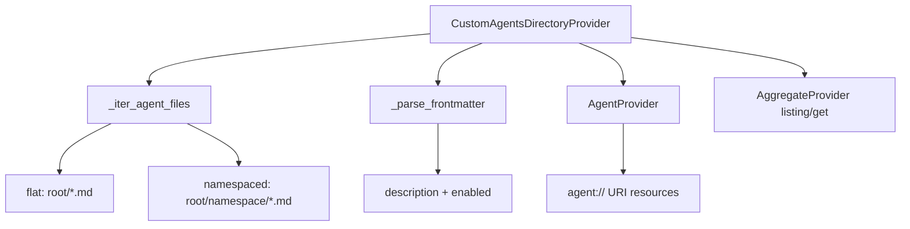

# `proxies/agent` Diagram

```mermaid
flowchart TD
    A[CustomAgentsDirectoryProvider] --> B[_iter_agent_files]
    B --> C[flat: root/*.md]
    B --> D[namespaced: root/namespace/*.md]

    A --> E[_parse_frontmatter]
    E --> F[description + enabled]

    A --> G[AgentProvider]
    G --> H[agent:// URI resources]

    A --> I[AggregateProvider listing/get]
```
