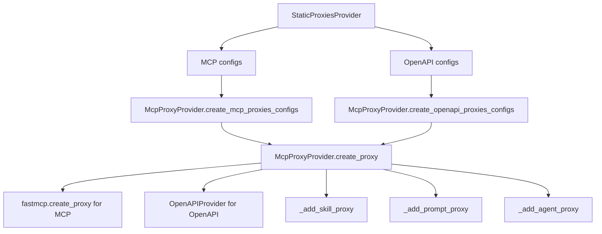

# `proxies/mcp` Diagram

```mermaid
flowchart TD
    A[StaticProxiesProvider] --> B[MCP configs]
    A --> C[OpenAPI configs]
    B --> D[McpProxyProvider.create_mcp_proxies_configs]
    C --> E[McpProxyProvider.create_openapi_proxies_configs]

    D --> F[McpProxyProvider.create_proxy]
    E --> F

    F --> G[fastmcp.create_proxy for MCP]
    F --> H[OpenAPIProvider for OpenAPI]
    F --> I[_add_skill_proxy]
    F --> J[_add_prompt_proxy]
    F --> K[_add_agent_proxy]
```
