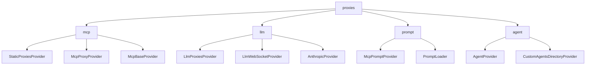

# `proxies/` Package Diagram

```mermaid
flowchart TD
    A[proxies]
    A --> B[mcp]
    A --> C[llm]
    A --> D[prompt]
    A --> E[agent]

    B --> B1[StaticProxiesProvider]
    B --> B2[McpProxyProvider]
    B --> B3[McpBaseProvider]

    C --> C1[LlmProxiesProvider]
    C --> C2[LlmWebSocketProvider]
    C --> C3[AnthropicProvider]

    D --> D1[McpPromptProvider]
    D --> D2[PromptLoader]

    E --> E1[AgentProvider]
    E --> E2[CustomAgentsDirectoryProvider]
```
