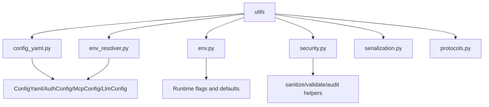

# `utils/` Package Diagram

```mermaid
flowchart TD
    A[utils]
    A --> B[config_yaml.py]
    A --> C[env.py]
    A --> D[env_resolver.py]
    A --> E[security.py]
    A --> F[serialization.py]
    A --> G[protocols.py]

    B --> H[ConfigYaml/AuthConfig/McpConfig/LlmConfig]
    D --> H
    C --> I[Runtime flags and defaults]
    E --> J[sanitize/validate/audit helpers]
```
